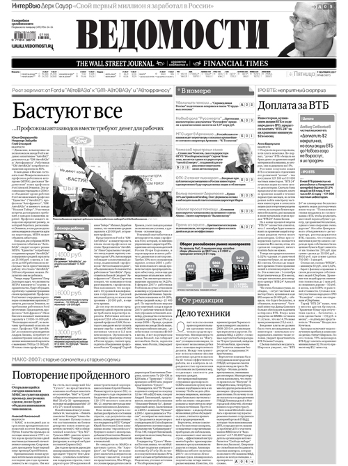
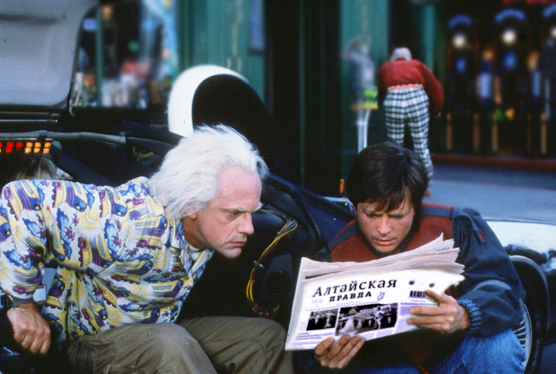

# Задача №3 "DeLorean DMC-12"
​
## Как отправить решение:
1. Склонируйте репозиторий ([тут](pull.md) есть описание как это сделать).
2. Напишите код в файлах ```delorean-dmc-12/src/index.css``` ```delorean-dmc-12/src/index.html```
3. Отправьте Pull Request. В качестве commit message пишите что изменилось.

## Основное задание
​
​
###⚠️ Задание необходимо решить без использования JS
Несколько лет назад Марти МакФлай прилетел из прошлого. Там в прошлом у него не было ни планшетов, ни летающих машин, ни самозашнуровывающихся кроссовок, а вся информация поступала из газет и телевизора.

Марти покупает электронную газету в ближайшей РосЭлектроПечати, но не может понять как ей пользоваться. Вам нужно сверстать эту электронную газету так, чтобы она выглядела максимально похоже на газету из 85 года.

Вот некоторые особенности газетной вёрстки того времени:
- Первая буква первого параграфа в статье обычно заметно выделяется
- А текст разбивается на колонки (минимум 4 на страницу)
- Есть, конечно, картинки и подписи к ним, иногда они занимают несколько колонок (ну хотя бы одно, которое занимает несколько колонок)
- Часто в тексте выделяют цитаты
- Обычно используют много разных нестандартных шрифтов (хотя бы три)
- В тексте используются переносы
- Изредка текст пишут:
```
В
О
Т

Т
А
К
```

Все остальные особенности на ваше усмотрение. Фантазия в данной задаче приветствуется, главное чтобы Марти сразу почувствовал себя как дома, и в руках у него тёплая ламповая печатная газета.

Пример современной газеты (так себе):



Пример старинной газеты (вот, гораздо лучше):


###Дополнительное задание (+1 к удаче на экзамене по матану)
⚠️ Задание необходимо решить **без использования JS**

Вечером мы с Марти идём пить чай с печенюшками к моей бабуленьке. Она тоже не прочь почитать свежих газеток. Будет очень любезно с вашей стороны, сделать газетку настраиваемой:
- Возможность увеличить/уменьшить шрифт
- Возможность поменять шрифт на другой, другого типа
- Возможность поменять «черные буквы на белом» на «белые буквы на чёрном» (или другую цветовое тему).


​

##Рекомендации к написанию кода:
⚠️Эти пункты учитываются при проверке⚠️

- Соблюдайте семантику - важно выработать привычку называть все своими именами
- HTML-разметка и css должны быть валидными - проверьте на сайте W3C [html](https://validator.w3.org/), [css](https://jigsaw.w3.org/css-validator/)
- В CSS не используйте универсальные селекторы и по идентификаторам, если в этом нет необходимости
- В CSS не используются селекторы элементов (кроме случаев, когда это селектор охватывает 1-2 элемента, например, body или html). Предпочтительны селекторы классов
- Старайтесь не дублировать название одного и того же класса, а селекторы с одинаковым набором правил группируются в один через запятую
- Не используйте !important и инлайн-стили, если в этом нет необходимости, а если есть причины - опишите в комментариях в коде
- Решение должно корректно отображаться и работать в последних версиях современных браузеров (Chrome, Firefox, Safari, YandexBrowser)
- Пишите комментарии в коде, почему приходится нарушать рекомендации

